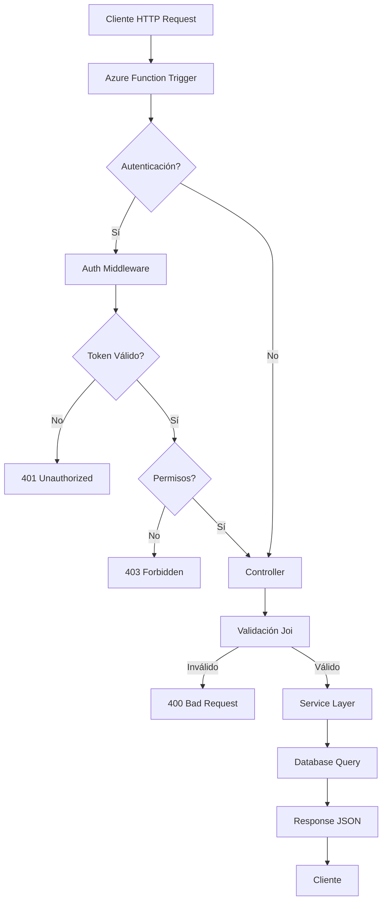

# Nubestock Backend - Sistema de Producción

## 📋 Tabla de Contenidos

- [Descripción](#-descripción)
- [Stack Tecnológico](#-stack-tecnológico)
- [Arquitectura](#-arquitectura)
- [Instalación y Configuración](#-instalación-y-configuración)
- [Estructura del Proyecto](#-estructura-del-proyecto)
- [Documentación Detallada](#-documentación-detallada)
- [API Endpoints](#-api-endpoints)
- [Autenticación y Autorización](#-autenticación-y-autorización)
- [Base de Datos](#-base-de-datos)
- [Seguridad](#-seguridad)
- [Despliegue](#-despliegue)
- [Testing](#-testing)
- [Logging](#-logging)
- [Contribución](#-contribución)

---

## 🚀 Descripción

**Nubestock Backend** es una API RESTful construida con **Azure Functions** y **TypeScript** que centraliza la gestión integral de inventario, producción, ventas y alertas para empresas productoras de snacks. El sistema está diseñado siguiendo principios de arquitectura modular y separación de responsabilidades.

### Características Principales

- ✅ **Serverless Architecture** - Despliegue en Azure Functions
- ✅ **Autenticación JWT** - Sistema robusto de autenticación y autorización
- ✅ **Gestión de Inventario** - Control completo de productos y materiales
- ✅ **Producción** - Registro y seguimiento de producción diaria
- ✅ **Ventas** - Gestión de clientes, ventas y pagos
- ✅ **Sistema de Alertas** - Notificaciones automáticas de stock bajo, mantenimiento, etc.
- ✅ **Reportes y Estadísticas** - Análisis detallado de operaciones
- ✅ **Multi-tenant** - Soporte para múltiples orígenes/ubicaciones

---

## 🛠️ Stack Tecnológico

### Core
- **Runtime**: Node.js 18+
- **Lenguaje**: TypeScript 5.3+
- **Framework**: Azure Functions v4
- **Base de Datos**: PostgreSQL 17+
- **Query Builder**: Knex.js 3.0+

### Librerías Principales

| Categoría | Librería | Versión | Propósito |
|-----------|----------|---------|-----------|
| **Autenticación** | jsonwebtoken | ^9.0.2 | Generación y validación de tokens JWT |
| **Seguridad** | bcryptjs | ^2.4.3 | Hashing de contraseñas |
| **Validación** | joi | ^17.13.3 | Validación de esquemas de datos |
| **Logging** | winston | ^3.11.0 | Sistema de logging estructurado |
| **Email** | @azure/communication-email | ^1.1.0 | Envío de correos electrónicos |
| **Utilidades** | lodash | ^4.17.21 | Funciones de utilidad |
| **Fechas** | moment | ^2.29.4 | Manipulación de fechas |
| **UUID** | uuid | ^9.0.1 | Generación de identificadores únicos |

### Herramientas de Desarrollo

- **TypeScript**: Compilación y tipado estático
- **ESLint**: Linting de código
- **Jest**: Framework de testing
- **Nodemon**: Hot-reload en desarrollo

---

## 🏗️ Arquitectura

### Patrón Arquitectónico

El proyecto sigue una **arquitectura modular basada en Azure Functions** con separación clara de responsabilidades:

```
┌─────────────────────────────────────────────────────────┐
│                    Azure Functions                       │
│  (Entry Points - auth, users, products, sales, etc.)    │
└────────────────────┬────────────────────────────────────┘
                     │
                     ▼
┌─────────────────────────────────────────────────────────┐
│                    Controllers Layer                      │
│  (Lógica de presentación - Validación, Respuestas)      │
└────────────────────┬────────────────────────────────────┘
                     │
                     ▼
┌─────────────────────────────────────────────────────────┐
│                    Services Layer                        │
│  (Lógica de negocio - AuthService, EmailService)         │
└────────────────────┬────────────────────────────────────┘
                     │
                     ▼
┌─────────────────────────────────────────────────────────┐
│                    Database Layer                        │
│  (Knex.js - Query Builder + PostgreSQL)                  │
└─────────────────────────────────────────────────────────┘
```

### Flujo de una Petición



### Estructura de Capas

1. **Azure Functions** (`/auth`, `/users`, `/products`, etc.)
   - Punto de entrada HTTP
   - Enrutamiento dinámico
   - Manejo de errores global

2. **Controllers** (`/src/controllers/`)
   - Validación de entrada
   - Llamadas a servicios
   - Formato de respuestas

3. **Services** (`/src/services/`)
   - Lógica de negocio
   - Reglas de dominio
   - Integraciones externas

4. **Database** (`/src/config/database.ts`)
   - Singleton de conexión
   - Métodos CRUD genéricos
   - Transacciones

5. **Middleware** (`/src/middleware/`)
   - Autenticación JWT
   - Validación de esquemas
   - Rate limiting

---

## 📁 Estructura del Proyecto

```
nubestock-backend/
├── .github/
│   └── workflows/              # CI/CD pipelines
├── alerts/                    # Azure Function: Alertas
│   ├── function.json
│   └── index.ts
├── auth/                      # Azure Function: Autenticación
│   ├── function.json
│   └── index.ts
├── clients/                    # Azure Function: Clientes
│   ├── function.json
│   └── index.ts
├── healthcheck/               # Azure Function: Health check
│   ├── function.json
│   └── index.ts
├── locations/                 # Azure Function: Ubicaciones
│   ├── function.json
│   └── index.ts
├── production/                # Azure Function: Producción
│   ├── function.json
│   └── index.ts
├── products/                  # Azure Function: Productos
│   ├── function.json
│   └── index.ts
├── roles/                     # Azure Function: Roles
│   ├── function.json
│   └── index.ts
├── sales/                     # Azure Function: Ventas
│   ├── function.json
│   ├── index.ts
│   └── reports.ts
├── stats/                     # Azure Function: Estadísticas
│   ├── function.json
│   └── index.ts
├── user-permissions/          # Azure Function: Permisos
│   ├── function.json
│   └── index.ts
├── users/                     # Azure Function: Usuarios
│   ├── function.json
│   └── index.ts
├── src/
│   ├── config/                # Configuración
│   │   ├── database.ts        # Singleton de conexión DB
│   │   ├── environment.ts     # Variables de entorno
│   │   ├── loadEnv.ts         # Carga de configuración
│   │   └── logger.ts          # Winston logger
│   ├── controllers/           # Controladores
│   │   ├── alertController.ts
│   │   ├── authController.ts
│   │   ├── bulkController.ts
│   │   ├── categoryController.ts
│   │   ├── clientController.ts
│   │   ├── locationController.ts
│   │   ├── materialController.ts
│   │   ├── measureController.ts
│   │   ├── originController.ts
│   │   ├── permissionController.ts
│   │   ├── productController.ts
│   │   ├── productionController.ts
│   │   ├── recipeController.ts
│   │   ├── roleController.ts
│   │   ├── saleController.ts
│   │   ├── userController.ts
│   │   └── userPermissionController.ts
│   ├── interfaces/           # Tipos TypeScript
│   │   └── index.ts
│   ├── middleware/            # Middlewares
│   │   ├── auth.ts            # Autenticación Express (legacy)
│   │   ├── authMiddleware.ts  # Autenticación Azure Functions
│   │   └── validation.ts     # Validación Joi
│   ├── services/             # Servicios de negocio
│   │   ├── authService.ts
│   │   └── emailService.ts
│   ├── types/                # Tipos personalizados
│   │   ├── azure-functions.ts
│   │   └── index.ts
│   └── utils/                # Utilidades
│       └── stockTransaction.ts
├── docs/                     # Documentación técnica
│   ├── Arquitectura.md
│   ├── API-Endpoints.md
│   ├── Base-de-Datos.md
│   ├── Seguridad.md
│   └── Despliegue.md
├── dist/                     # Código compilado (generado)
├── host.json                 # Configuración Azure Functions
├── local.settings.json       # Variables de entorno local
├── package.json
├── tsconfig.json
└── README.md
```

---

## 🚀 Instalación y Configuración

### Prerrequisitos

- **Node.js** 18.0.0 o superior
- **PostgreSQL** 17+ (local o Azure Database)
- **Azure Functions Core Tools** v4
- **npm** o **yarn**

### Instalación

```bash
# 1. Clonar el repositorio
git clone <repository-url>
cd nubestock-backend

# 2. Instalar dependencias
npm install

# 3. Compilar TypeScript
npm run build

# 4. Configurar variables de entorno
cp local.settings.json.example local.settings.json
# Editar local.settings.json con tus credenciales
```

### Variables de Entorno

Ver documentación completa en [`docs/Seguridad.md`](./docs/Seguridad.md#variables-de-entorno)

**Variables Requeridas:**
```json
{
  "DATABASE_HOSTNAME": "localhost",
  "DATABASE_PORT": "5432",
  "DATABASE_USERNAME": "postgres",
  "DATABASE_PASSWORD": "password",
  "DATABASE_NAME": "nubestock",
  "JWT_SECRET": "tu-secret-key-super-segura",
  "DB_SSL": "false"
}
```

### Desarrollo Local

```bash
# Ejecutar en modo desarrollo (con hot-reload)
npm run dev

# O usar Azure Functions Core Tools
func start
```

El servidor estará disponible en `http://localhost:7071`

---

## 📚 Documentación Detallada

La documentación técnica completa está disponible en la carpeta [`/docs`](./docs/):

- **[Arquitectura.md](./docs/Arquitectura.md)** - Arquitectura detallada, flujos y patrones
- **[API-Endpoints.md](./docs/API-Endpoints.md)** - Documentación completa de endpoints
- **[Base-de-Datos.md](./docs/Base-de-Datos.md)** - Modelo de datos y esquemas
- **[Seguridad.md](./docs/Seguridad.md)** - Configuración de seguridad y variables de entorno
- **[Despliegue.md](./docs/Despliegue.md)** - Guías de despliegue y scripts

---

## 📡 API Endpoints

### Base URL

- **Local**: `http://localhost:7071/api`
- **Producción**: `https://<function-app-name>.azurewebsites.net/api`

### Autenticación

| Método | Endpoint | Descripción | Auth |
|--------|----------|-------------|------|
| POST | `/auth/login` | Iniciar sesión | No |
| POST | `/auth/register` | Registrar usuario | No |
| POST | `/auth/refresh` | Refrescar token | No |
| POST | `/auth/logout` | Cerrar sesión | Sí |
| POST | `/auth/change-password` | Cambiar contraseña | Sí |
| POST | `/auth/reset-password` | Solicitar reset | No |
| PUT | `/auth/reset-password` | Restablecer contraseña | No |
| POST | `/auth/admin-reset-password` | Reset por admin | Admin |

### Usuarios

| Método | Endpoint | Descripción | Permisos |
|--------|----------|-------------|----------|
| GET | `/users` | Listar usuarios | `users_read` |
| GET | `/users/{id}` | Obtener usuario | `users_read` |
| POST | `/users` | Crear usuario | `users_write` |
| PUT | `/users/{id}` | Actualizar usuario | `users_write` |
| DELETE | `/users/{id}` | Eliminar usuario | `users_manage` |

### Productos

| Método | Endpoint | Descripción | Permisos |
|--------|----------|-------------|----------|
| GET | `/products` | Listar productos | `products_read` |
| GET | `/products/{id}` | Obtener producto | `products_read` |
| POST | `/products` | Crear producto | `products_write` |
| PUT | `/products/{id}` | Actualizar producto | `products_write` |
| DELETE | `/products/{id}` | Eliminar producto | `products_write` |
| GET | `/products/categories` | Listar categorías | `products_read` |
| GET | `/products/origins` | Listar orígenes | `products_read` |
| GET | `/products/materials` | Listar materiales | `products_read` |
| GET | `/products/recipes` | Listar recetas | `products_read` |
| POST | `/products/recipe` | Crear receta | `products_write` |
| POST | `/products/bulk` | Crear productos masivo | `products_write` |
| POST | `/products/check-stock` | Verificar stock | `products_read` |
| POST | `/products/stock-operation` | Operación de stock | `inventory_manage` |

### Ventas

| Método | Endpoint | Descripción | Permisos |
|--------|----------|-------------|----------|
| GET | `/sales` | Listar ventas | `sales_read` |
| GET | `/sales/{id}` | Obtener venta | `sales_read` |
| POST | `/sales` | Crear venta | `sales_write` |
| PUT | `/sales/{id}` | Actualizar venta | `sales_write` |
| PUT | `/sales/payment` | Actualizar pago | `sales_write` |
| GET | `/sales/stats` | Estadísticas | `sales_read` |
| GET | `/sales/overdue` | Ventas vencidas | `sales_read` |
| GET | `/sales/reports/daily` | Reporte diario | `reports_read` |
| GET | `/sales/reports/by-client` | Reporte por cliente | `reports_read` |

### Producción

| Método | Endpoint | Descripción | Permisos |
|--------|----------|-------------|----------|
| GET | `/production` | Listar producción | `production_read` |
| GET | `/production/stats` | Estadísticas | `production_read` |
| POST | `/production` | Registrar producción | `production_write` |

### Estadísticas

| Método | Endpoint | Descripción | Permisos |
|--------|----------|-------------|----------|
| GET | `/stats` | Estadísticas generales | `reports_read` |

> **Nota**: Para documentación completa de endpoints, ver [`docs/API-Endpoints.md`](./docs/API-Endpoints.md)

---

## 🔐 Autenticación y Autorización

### Flujo de Autenticación

1. **Login**: Usuario envía credenciales → Recibe JWT token + refresh token
2. **Request Autenticado**: Cliente envía token en header `Authorization: Bearer <token>`
3. **Validación**: Middleware verifica token y carga información del usuario
4. **Autorización**: Se verifica que el usuario tenga los permisos necesarios

### Roles y Permisos

El sistema utiliza un modelo **RBAC (Role-Based Access Control)** con permisos granulares:

**Roles Principales:**
- `Administrator` - Acceso completo al sistema
- `Production Manager` - Gestión de producción
- `Sales Manager` - Gestión de ventas
- `Inventory Manager` - Gestión de inventario

**Permisos Comunes:**
- `admin` - Acceso administrativo completo
- `users_read`, `users_write`, `users_manage`
- `products_read`, `products_write`
- `sales_read`, `sales_write`
- `production_read`, `production_write`
- `inventory_manage`
- `reports_read`

> **Nota**: Ver [`docs/Seguridad.md`](./docs/Seguridad.md) para detalles completos

---

## 🗄️ Base de Datos

### Esquema: `nubestock`

El sistema utiliza PostgreSQL con un esquema dedicado. Las tablas principales incluyen:

**Maestros (tb_mae_*):**
- `tb_mae_user` - Usuarios
- `tb_mae_role` - Roles
- `tb_mae_permission` - Permisos
- `tb_mae_category` - Categorías de productos
- `tb_mae_origin` - Orígenes/Ubicaciones
- `tb_mae_client` - Clientes
- `tb_mae_alert` - Alertas
- `tb_mae_machinery` - Maquinaria

**Operaciones (tb_ope_*):**
- `tb_ope_transaction` - Transacciones de inventario
- `tb_ope_sales` - Ventas
- `tb_ope_sales_detail` - Detalles de ventas
- `tb_ope_password_reset_token` - Tokens de reset

> **Nota**: Ver [`docs/Base-de-Datos.md`](./docs/Base-de-Datos.md) para esquema completo

---

## 🔒 Seguridad

### Medidas Implementadas

- ✅ **JWT Authentication** - Tokens firmados y con expiración
- ✅ **Password Hashing** - bcrypt con 12 rounds
- ✅ **CORS** - Configuración restrictiva
- ✅ **Rate Limiting** - Protección contra abuso
- ✅ **Input Validation** - Validación con Joi
- ✅ **SQL Injection Protection** - Knex.js con parámetros preparados
- ✅ **HTTPS** - Encriptación en tránsito (Azure)
- ✅ **Environment Variables** - Secretos fuera del código

> **Nota**: Ver [`docs/Seguridad.md`](./docs/Seguridad.md) para configuración detallada

---

## 🚀 Despliegue

### Desarrollo Local

```bash
# Ejecutar Azure Functions localmente
func start

# O con npm
npm run dev
```

### Despliegue en Azure

```bash
# 1. Login en Azure
az login

# 2. Compilar proyecto
npm run build

# 3. Desplegar
func azure functionapp publish <function-app-name>
```

> **Nota**: Ver [`docs/Despliegue.md`](./docs/Despliegue.md) para guía completa

---

## 🧪 Testing

```bash
# Ejecutar tests
npm test

# Tests con coverage
npm run test:coverage

# Tests en modo watch
npm run test:watch
```

---

## 📝 Logging

El sistema utiliza **Winston** para logging estructurado:

- **Niveles**: `error`, `warn`, `info`, `debug`
- **Archivos**: `logs/error.log`, `logs/combined.log`, `logs/audit.log`
- **Formato**: JSON en producción, texto en desarrollo

---

## 🤝 Contribución

1. Fork el proyecto
2. Crear rama para feature (`git checkout -b feature/AmazingFeature`)
3. Commit cambios (`git commit -m 'Add some AmazingFeature'`)
4. Push a la rama (`git push origin feature/AmazingFeature`)
5. Abrir Pull Request

---

## 📄 Licencia

Este proyecto está bajo la Licencia MIT.

---

## 📞 Soporte

- **Documentación**: Ver carpeta [`/docs`](./docs/)
- **Issues**: [GitHub Issues](https://github.com/nubestock/backend/issues)

---

**Nubestock Backend v2.0.0** - Sistema de Producción Optimizado 🚀
